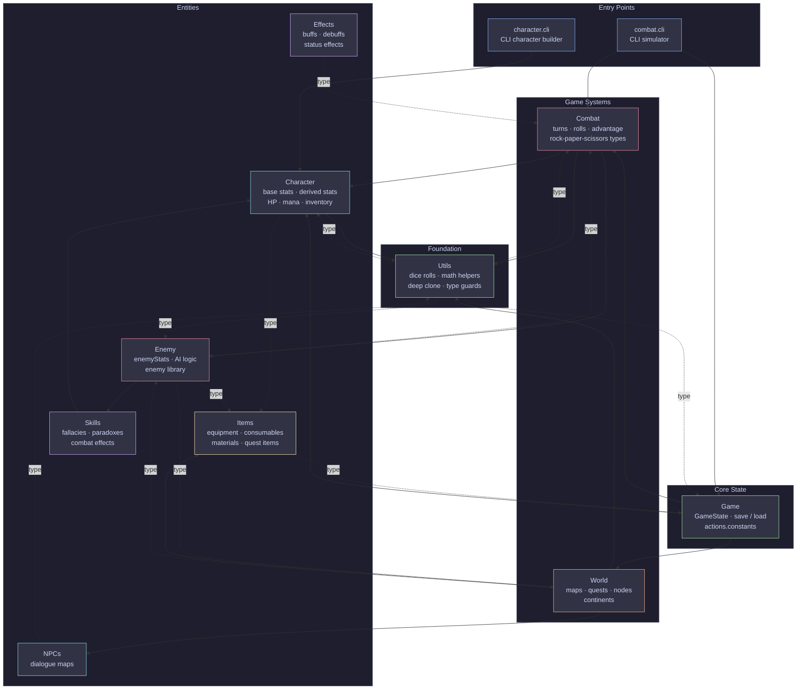

# Axiomancer Mechanics — Architecture



## Legend

| Arrow | Meaning |
|-------|---------|
| `-->` | Runtime import — values, functions, instances |
| `-.->` | Type-only import — interfaces and type aliases only |

## Module Summary

| Module | Role |
|--------|------|
| **Game** | Top-level state orchestrator; handles save/load and wires all systems together |
| **Combat** | Turn logic, dice rolls, type-advantage (Heart › Body › Mind › Heart), battle log |
| **World** | Map graph, quest tracking, continent definitions, node traversal |
| **Character** | Player character creation; derives stats from `BaseStats`; owns inventory |
| **Enemy** | Enemy definitions, stat tables, AI decision logic |
| **Items** | Equipment, consumables, materials, quest items; inventory reducers |
| **Skills** | Fallacy/paradox-themed combat skills; usage and damage calculation |
| **Effects** | Buff/debuff system; status effect types and application results |
| **NPCs** | Dialogue maps for non-player characters |
| **Utils** | Pure utility functions — dice creation, math helpers, deep clone, type guards |
```
